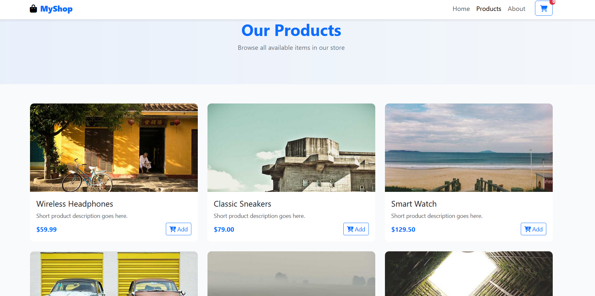

# E-commerce-HTML-Template
Modern, responsive e-commerce template built with Bootstrap 5 and vanilla JavaScript. Features product grid, featured products carousel and a clean customizable design.


  
  

---

## Table of Contents

- [Features](#features)  
- [Installation](#installation)
  
---

## Features

- Fully responsive design (mobile, tablet, desktop)  
- Product grid with working Add to Cart functionality  
- Featured products carousel with automatic and manual sliding  
- Persistent cart using `localStorage`  
- Clean, minimal design ready for customization  
- Subscription form and demo checkout flow  

---

## Installation

1. Clone the repository:

```bash
git clone https://github.com/FFisher190/E-commerce-HTML-Template.git
